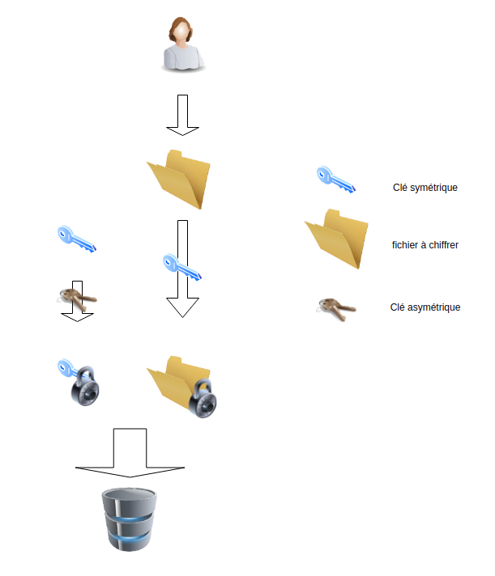

# laboratoire CAA - 2

> Jérôme Arn

# Hypothèse 

Pour mon implémentation je pars du principe que les clients du serveurs sont déjà enregistrés dans la base de donnée du serveur. De ce fait, aucun moyen d'enregistrer n'est mis en place. Le nom d'utilisateur est sous la forme d'un email, cela afin d'être sûr d'avoir un identifiant unique. 

Je vais aussi assumer que pour des raisons de sécurité l’authentification à double facteur est obligatoire. 

Je vais considérer que les clés publiques de chaque membre du cloud sont déjà en possession de tous les utilisateurs. 

# Constantes

## Argon2id

Lors de l'utilisation d'argon2id pour dériver des clés, je me suis basé sur les constantes suivantes en terme de coût. 

- Degré de parallélisme: 4 threads
- Utilisation mémoire: 1 Go
- Taille de sel: 128 bits 
- Temps d'exécution: 1 sec

Le choix de ces constantes s’appuie en partie sur les conseils donnés en CAA et sur une appréciation personnelle des capacités de calcul d'un ordinateur moyen.  Ces paramètres sont supposés communs entre le client et le serveur. Le temps d'une seconde est aussi assez décourageant pour un attaquant mais n'altère pas l'expérience utilisateur.

# Protocole d'authentification

- Pour commencer le protocole, le client envoie son nom d'utilisateur au serveur.

- Si le serveur connaît cet utilisateur, il lui envoie un nombre aléatoire ainsi que le sel pour dériver la clé du MAC. 

  Sinon, il affiche un message d'erreur.

- Le client renvoie un MAC fait avec la clé dérivée d'argon2id et du nombre aléatoire envoyé par le serveur. 

- Si c'est en ordre, le serveur répond avec la demande de son jeton de double authentification.

- Si c'est toujours en ordre, le serveur lui attribue un jeton d'authentification pour les prochaines requêtes

  

```sequence
Client->>Serveur: <username>
Serveur->>Client: Nonce + Salt(argon2id)
Client->>Serveur: HMAC(Nonce)
Serveur->>Client: Ask 2fa code
Client->>Serveur: 2fa code
Serveur->>Client: Token d'authentification
```

Une fois cette première étape passée, Une vérification à double facteur intervient. Je me baserais sur google authenticator. 

# Chiffrement 

Pour le chiffrement des fichiers, j'ai choisi le chiffrement symétrique avec AES-GCM. La clé de chiffrement sera de 256 bits afin d'avoir une sécurité à long terme. Comme cette clé sera envoyée sur le serveur, un chiffrement asymétrique sera utilisé. Je vais travailler avec ECIES afin d'avoir une taille clé retreinte, 256 bits, mais qui permet quand même d'avoir une protection sur 10 ans selon les standards ECRYPT. À noter que cette paire de clé sera la même pour chaque dossier. 

Si Alice veut partagé un fichier avec Bob et Pierre, la clé symétrique sera envoyée en trois exemplaires. Chaque exemplaires sera signé avec la clé public d'un des participants. 

Le déroulement du chiffrement est illustré ci-dessous. La personne voulant chiffrer son fichier va le faire avec la clé symétrique (ici en bleu). Puis la clé symétrique va elle aussi être chiffrée par la clé publique (ici en brun) de la personne effectuant le chiffrement. Ces deux éléments seront ensuite envoyé au serveur. 



Les éléments tel que nonce pour le chiffrement symétrique et sel pour la dérivation des clés seront aussi stockés sur le serveur mais n'apparaissent pas sur le schéma pour améliorer sa lisibilité.

# Implémentation

Pour le lancement de l'application:

```sh
cd server && cargo run 
// attendre que le serveur affiche "Le serveur est prêt à recevoir des requêtes"
cd client && cargo run 
```

le client va faire une authentification, un upload d'un fichier, demander la liste des fichiers qu'il peut lire et le téléchargement du même fichier.

L'envoi de la liste chiffrée est malheureusement très simplifié car l'envoi de manière sécurisée, comme pour les fichiers, aurait nettement complexifié l'architecture et je n'avais pas le temps de l'implémenter. Mais c'est quand même chiffré pour respecter la consigne.  
